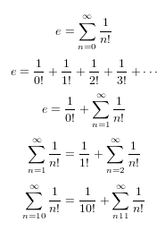

c Program Statements
====================

01 Simple Ouput
---------------

Write down a program that outputs 10 times the name passed
as a parameter at command line invocation.

```bash
the_owl@eniac:~$ ./repeat "what does the fox say?"
```
Escribir un programa que repita 10 veces el nombre anexado
en la invocación de la linea de comandos.


02 Mean
-------

Calculate the mean of 10 numbers given by the user.

Calculat lt
+ media de 10 números proporcionados por el usuario.


03 Mean
-------

Ask numbers while the user introduces something greater or equal to 0.
Show the mean of the given numbers.

Calcular la media de todos los números introducidos por el usuario.
Se tomarán todos los números hasta que se introduzca algo menor que 0. 
El último número no se tomará en cuenta.

04 Triangle
-----------

Given the height, build a triangle as in the example with the character provided in the invocation.

    l = 4
    
    *
    **
    ***
    ****

```bash
the_owl@eniac:~$ ./trinagle "*"
```

05 List of Words
----------------

Complete the following program in order to print the list of words.

```c
  int main() {
  

  
```
     const char *list[] = {
       "bread", 
       "toast",
       "bacon"
     };
     
  }

Find the way (using sizeof operator) to print the number of words defined in the list.

06 Square Border
----------------

Write a program that outputs the border of a square, given the height, like in the example:

When h=4

    ****
    *  *
    *  *
    ****

When h=7

    *******
    *     *
    *     *
    *     *
    *     *
    *     *
    *******
    

07 Adding
---------

Define a function with the following signature:

```c
  double add(double,  double);
```

Function _main_ shall fetch operands from command line.


```bash
the_owl@eniac:~$ ./add 2.3 5.8
```

08 Adding
---------

Arrange the _main_ function of problem number 07 to accept a variable number of arguments.

09 I got the Power
------------------

Write a program to raise N numbers to the _<command line argument>_ power of two.

```c
#define N 0x10

int power(int base, int exponent) {

}

void fill_in(int list[N], ...) {

}

int main(...) {

   int list[N];
   
   fill_in(list, ...);
}

```

```bash
the_owl@eniac:~$ ./raise_to 3

# => 1 8 27 ....
```

10 Print Backwards
------------------

Print a string backwards.

```c
int main(...) {

  const char *sentence  = "The world is a vampire.";
  const char *beginning = sentence;
  const char *end       = sentence;
  
  /* Move end to the last byte in sentence*/

  /* print from end to beginning */
}

```

```bash
the_owl@eniac:~$ ./print_backwards

# => .eripmav a si dlrow ehT
```

11 Sort
-------

Print sorted. strcmp. 

```c
int main(...) {

  const char *list[] = { "yield", "yelp"};
  

```


12 Sort
-------

Print sorted. strcmp. 

```c
int main(...) {

  const char *list[] = { "yield", "yelp", "yellow"};
  

```

13 Primes
---------

A given number is prime when is not is divided by the lower primes. Find the 70 first primes.

```c
#define N 70

int main() {

  int primes[N];
  primes[0] = 2;
  int primes_found = 1;
  
  
  int possible_prime = 3;
  
  /* Check the primality of the possible_prime and go for the next */

  return EXIT_SUCCESS;
}
```

14 Sort an Array of intgers
---------------------------

Sort this array.

```c
int main(){
   int A[] = {22, 3, 77, 50, 40, 23, 37, 35, 22, 2, 61, 71, 0};
}
```

RECURION
=========

15  Factorial
-------------

Calculate recursively the product of the N first Natural numbers.


16 Print Backwards
------------------

Solve excercise number 10 using recursion.

17 Continous fraction
---------------------

Calculate the continous fraction of _n_ with 10 levels of recursion.


18 e
----

Add the serie that yields e.




Future Work
===========

```c
#include <iostream>
using namespace std;

int a = 1;
int f(int a) { return a; }
int g(int x = f(a)) { return x; }

int h() {
  a = 2;
  {
    int a = 3;
    return g();
  }
}

int main() {
  cout << h() << endl;
}
```

